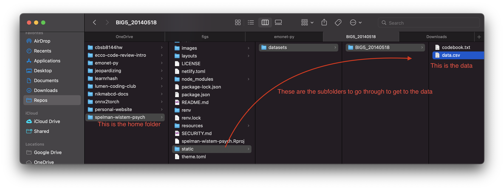

```{r setup, include=FALSE}
knitr::opts_chunk$set(echo = TRUE)

library(tidyverse)
```

## Lecture notes

In our first class, we started off with **orienting to the RStudio interface,** **reading data into R,** and **recoding categorical columns in data.**

### Orienting to RStudio

#### Console window

In the automatic configuration of RStudio’s panes/mini-windows, the console is likely in the bottom left. In general, you can type R commands in the console, and press Enter to execute those commands. This is where you can execute R code!

Note: the console is a great place to try out new stuff, but it doesn’t save your code as one piece the way a script does – for the most part it is good practice to be writing scripts.

#### Editor window

In everyday RStudio life, though, you’ll likely spend most of your time in the editor window (default position should be upper left pane). This is where you edit R script files. R scripts are files that contain R code typed out that you can write once, and then run as many times as you want. You’ll do the vast majority of your code writing in script files, so that you can have records of the data processing and analyses you’ve written.

#### Environment/history window

In this window (default position: upper right pane), you can see some useful stuff pertaining to your current R session:

Environment: this is where you can see all of the data you currently have loaded in your R session, or any other variables you’ve created.
History: this is where you can see your command history of all the R commands you’ve run in this session. Use it wisely!

#### Files/pkgs/help window

In this window (default position: lower right pane), you can see even more useful stuff:

- **Files:** This is a rudimentary file browser, in case you want to use this to click through your folders and open R scripts.
- **Plots:** If you render a graph, it appears in this tab.
- **Packages:** This is a list of all the packages you have installed. You can install new packages/update existing ones using the buttons you see on the top of the tab. Any packages that are currently loaded in your R session will have the check box checked.
- **Help:** You can search for and read documentation of any R function here. I spend a lot of time here!

### Reading data into R

In order to read in data into R's memory and actually analyze it, you need to know two pieces of information about your current R project:

1. Where R's _home directory_ is
1. The **relative path** to the data: aka where the data is saved, _relative to the home directory_

Every R session has a working directory, or a "home base" folder. Essentially, this is the folder that R is "in." R is not actually installed in this folder, mind you! The working directory is the first folder where R looks for raw data files to load in. You can find out what folder is your working directory using the `here()` command as below.

```{r}
here::here()
```

```{r, echo=FALSE}
blogdown::shortcode_html(.name = "alert",
                         icon = "️💡",
                         .content = "This is different than the project folder path you'll get on RStudio Cloud. And that’s okay! Our folder structures on our computers (and on the cloud) are all different.")
```

Usually, if you're running this on RStudio Cloud, it'll say something like:

```
## [1] "/Cloud/project"
```

RStudio Cloud sets this as the home directory for any project. That way, when you save raw data, scripts, and other relevant files in subfolders of your home directory, it makes them easier to access.

In the R project folder on my computer where these website files are saved, this is the **path** that I take from the project folder down to get to the data:



In computer terms, we can spell out this path by using the forward-slash `/` to go from subfolder to subfolder starting from the home folder, ending up at the data.

```
"static/datasets/BIG5_20140518/data.csv"
```

Once we have that path, we can feed that path into `read_tsv()`, which reads the data into our R environment. Finally, we use the **assignment operator** `<-` to store the data in a **variable** named `big5_raw`, so that we can hold onto that data and actually operate on it.

```{r}
# I am using another way of specifying the relative path: we'll learn about this soon!
big5_raw <- read_tsv(here::here("static", "datasets", "BIG5_20140518", "data.csv"))
```

We can now take a peek at what the raw data look like. When you're using R interactively, you can click on the object's name in the Environment pane and scroll around in the Viewer, but you can also preview the data in console output by _printing_ the contents of the variable containing the data.

```{r}
big5_raw
```

When we read a table of data into R, the resulting object is called a **dataframe.** Our dataframe has `r nrow(big5_raw)` observations, with each row coming from a different participant (I think/hope!), and `r ncol(big5_raw)` columns of data for each participant.

### Recoding categorical columns

One of the first things we need to do before we actually work with the data is to _clean it up_ and make it more human-sensible. Often times, data are coded in particular ways to make it easier for _computers,_ but these data coding choices make the data harder for _humans_ to make sense of.

**It's really important to make sure that we understand what each column of our data means, so that we then understand the best analyses to use to explore our data.**

As such, the first thing we'll do is identify _categorical_ columns of the data, that represent groups of multiple-choice values, and _recode_ those values with text descriptions of each multiple-choice level. This will make it so that we don't have to keep remembering what the 1s, 2s, and 3s in each column refer to.

For this, we need 2 main functions:

- `mutate()` allows us to add new columns (or replace columns) in our dataframe
- inside of `mutate()`, `fct_recode()` allows us to change the levels of a categorical variable to values that are more human-readable

First, we use the `.data` argument to tell `mutate()` which dataframe we want to modify the columns of. Then, `mutate()` takes the following syntax to create columns: `new_column_name = function_of(old_column_name)`. You can also overwrite the content of old columns: `old_column_name = function_of(old_column_name)`.

When we use `fct_recode()` to make a new categorical column out of a numeric-coded multiple choice column, we use the syntax: `"new_level" = "old_level"`. While it doesn't work the exact same way under the hood, in general, the old name goes on the right-hand side of the `=`, and the new name goes on the left-hand side.

Finally, we use `<-` to assign the modified dataframe back to a variable so that we can continue to access it later. If we don't do this, the modified column isn't saved anywhere and it's like we didn't recode anything at all. I am reassigning the modified dataframe to a _new_ variable name called `big5_recoded`, so that I still have the totally fresh dataframe stored under `big5_raw` in case I made a mistake and I need to re-run code starting from the original data.

```{r}
big5_recoded <- mutate(.data = big5_raw,
                       # We need to turn gender from numeric to character first!
                       gender = fct_recode(as.character(gender),
                                           "male" = "1",
                                           "female" = "2",
                                           "other" = "3",
                                           # I'm using this to set the missing values as NA
                                           NULL = "0"))
```

You can now use this general logic to recode the other multiple-choice columns into human-readable text values.

## Other thoughts

If you find a dataset you think you'd like to explore, bookmark it and bring it to class!

Check out the [syllabus section for course readings](/docs/syllabus/readings) to get to the course textbook. I'll also be updating it with other useful blog posts and web pages that you can check out for additional scientific computing support.
