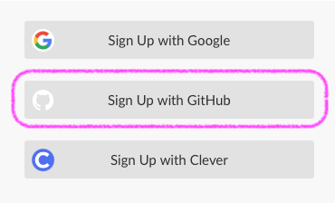

```{r setup, include=FALSE}
knitr::opts_chunk$set(echo = FALSE)
```

## What is RStudio (Cloud)?

In this course, we'll be doing scientific computing in R. RStudio is a popular IDE (_integrated development environment:_ a program that helps you write, run, and debug code) designed specifically for R, and it's the one I personally use.

It can be a little bit of a headache for every single student in the class to download R (the computing language), RStudio (the program for _writing_ the code), and all the additional R packages (very very useful functions) on their own. Different people have different computers with different operating system versions, and this can create annoying individual issues where different people have trouble installing different things, and we can't all follow along with lessons together.

So, in this class, we'll be using RStudio Cloud, where we can access R and RStudio pre-installed on a cloud server we can access through a web browser.

## Make an account

Go to [posit.cloud](https://posit.cloud) and click the "Get Started" button. Don't worry about the different subscription plans--choose the "Cloud Free" plan. (You'll be logging into a special cloud instance for the class, and you only need the free level for that.) Click "Learn More" under Cloud Free on the list of subscription plans, and then "Sign Up."

Now, this is important! Scroll down to choose the "sign up with GitHub" option to create your account by linking it to [your GitHub account.](../sign-up-for-github/) It'll be helpful later!



That's all for now! In class together, we'll connect your account with the class account. This lets me get access to your code projects and help you debug things if you run into errors.

**A final note:** Cloud compute hours aren't free, unfortunately. 😓 The class account gets charged a little bit per every hour that you have RStudio Cloud running. We have more than enough money budgeted for you to be able to work on all of your problem sets for the class, but I ask that you be mindful not to leave RStudio Cloud running in your web browser if you're not actually using it. If you have a zillion tabs open like I do, it can be easy to lose track, so thank you for your attention!

```{r}
blogdown::shortcode_html(.name = "alert",
                         icon = "‼️",
                         .content = "Please close your RStudio Cloud tab when you're not using it so we don't get charged extra!")
```
